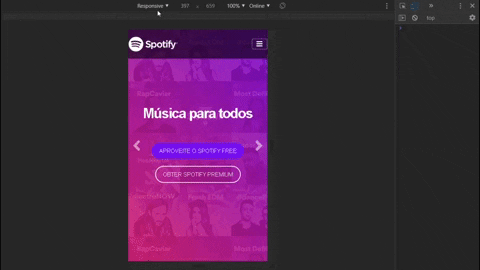

# Spotify Page Clone :musical_note:
Esse projeto se trata de uma página web baseada na página do Spotify de 2016 até 2018, no desenvolvimento dela utilizei somente HTML e Bootstrap 4

## Resultado final :clipboard:

:arrow_forward: Você pode ver o resultado final desse projeto no ar clicando aqui: https://tiagodiass.github.io/spotify-page-clone 
E você também pode ver um preview de como ele ficou nos GIFs logo abaixo :arrow_heading_down: 

### Mobile :iphone:

### Desktop :computer:

